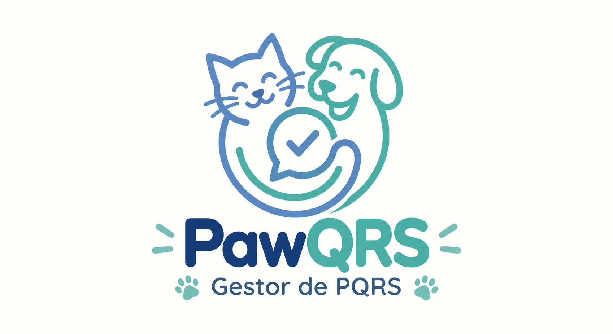

# PawQRS - Gestor de PQRS

Proyecto integrador de **Algoritmia y Programación 2026-2** orientado al desarrollo de un gestor de Peticiones, Quejas, Reclamos y Sugerencias (PQRS) relacionadas con la atención de perros y gatos.

---

## 1. Integrantes

El equipo de trabajo está conformado por cinco estudiantes del programa de Ingeniería Industrial de la Universidad de Antioquia.

### Estefania Jiménez Jaramillo
- **Rol:** Líder del equipo / Gestión de GitHub
- **Programa:** Ingeniería Industrial
- **Semestre:** Cuarto semestre
- **Correo:** estefania.jimenezj@udea.edu.co

### Santiago Franco Lopez
- **Programa:** Ingeniería Industrial
- **Semestre:** Séptimo semestre
- **Correo:** santiago.franco6@udea.edu.co

### Isabela Maria Rodríguez Ramos
- **Programa:** Ingeniería Industrial
- **Semestre:** Quinto semestre
- **Correo:** isabela.rodriguez1@udea.edu.co

### Daniela Zapata Henao
- **Programa:** Ingeniería Industrial
- **Semestre:** Tercer semestre
- **Correo:** daniela.zapatah@udea.edu.co

### María Camila Ocampo Rúa
- **Programa:** Ingeniería Industrial
- **Semestre:** Cuarto semestre
- **Correo:** mcamila.ocampo@udea.edu.co

---

## 2. Vínculos académicos y descripción

Todos los integrantes del equipo pertenecen al programa de **Ingeniería Industrial de la Universidad de Antioquia**.

### Estefania Jiménez Jaramillo
Se caracteriza por su capacidad para el **trabajo en equipo, la comunicación asertiva y la adaptabilidad**, habilidades que le permiten coordinar actividades, mantener una comunicación clara con los integrantes y responder adecuadamente a los cambios y necesidades del proyecto.

### Santiago Franco Lopez
Se destaca por su **responsabilidad, puntualidad, pensamiento crítico y capacidad para trabajar en equipo**. Estas fortalezas contribuyen al cumplimiento de los compromisos establecidos y al análisis de diferentes alternativas para la solución de problemas.

### Isabela Maria Rodríguez Ramos
Se caracteriza por su **creatividad, determinación y perseverancia**, cualidades que favorecen la generación de ideas y la búsqueda constante de soluciones ante las dificultades que puedan presentarse durante el desarrollo del proyecto.

### Daniela Zapata Henao
Se destaca por su **constancia, creatividad, responsabilidad y organización**, fortalezas que contribuyen al seguimiento de las actividades y al cumplimiento de las tareas asignadas dentro del proyecto.

### María Camila Ocampo Rúa
Se caracteriza por su **compromiso, comunicación asertiva y capacidad para trabajar en equipo**, habilidades que facilitan la coordinación con los demás integrantes y el cumplimiento de los objetivos establecidos.

---

## 3. Nombre del proyecto y detalles

### PawQRS

**PawQRS** es un sistema de gestión de Peticiones, Quejas, Reclamos y Sugerencias (PQRS) orientado al registro y seguimiento de solicitudes relacionadas con la atención de perros y gatos.

El proyecto busca facilitar la gestión de la información recibida por MEPEGA, permitiendo organizar los datos de los solicitantes, registrar las PQRS, realizar su seguimiento y consultar información relevante para apoyar su gestión.

El sistema será desarrollado en **Python** y permitirá almacenar la información mediante archivos planos, siguiendo los requerimientos establecidos para el proyecto.

---

## 4. Licencia del software

El proyecto **PawQRS - Gestor de PQRS** se encuentra registrado bajo la licencia **Creative Commons Atribución-NoComercial-CompartirIgual 4.0 Internacional (CC BY-NC-SA 4.0)**.

Esta licencia permite compartir, adaptar y modificar el contenido del proyecto, siempre que se reconozca la autoría de sus creadores, no se utilice con fines comerciales y las adaptaciones realizadas se compartan bajo la misma licencia.

### Autores

- Estefania Jiménez Jaramillo
- Santiago Franco Lopez
- Isabela Maria Rodríguez Ramos
- Daniela Zapata Henao
- María Camila Ocampo Rúa

**Año:** 2026

---

## 5. Reporte de visión

### 5.1 Descripción general

**PawQRS** es un sistema desarrollado para apoyar la gestión de Peticiones, Quejas, Reclamos y Sugerencias (PQRS) relacionadas con la atención de perros y gatos.

El sistema será desarrollado en Python y contará con una interfaz de consola que permitirá al administrador registrar, consultar y actualizar la información de las PQRS. Los registros serán almacenados mediante archivos planos independientes de acuerdo con el tipo de solicitud.

### 5.2 Problemática

MEPEGA recibe PQRS por diferentes canales, como redes sociales, correo electrónico, atención presencial, teléfono y otros medios. Actualmente, la información debe ser procesada de forma manual, lo que hace necesario contar con una herramienta que facilite su registro, organización y seguimiento.

Además, cada PQRS requiere un número de radicado consecutivo e independiente, información del solicitante, clasificación de la solicitud, información relacionada con la mascota, fechas de gestión y un estado que permita realizar seguimiento al proceso.

### 5.3 Objetivo general

Desarrollar **PawQRS**, un sistema de consola en Python que permita gestionar de manera organizada las Peticiones, Quejas, Reclamos y Sugerencias relacionadas con la atención de perros y gatos, mediante el registro, almacenamiento, consulta, actualización y análisis de la información.

### 5.4 Objetivos específicos

- Registrar la información de las PQRS y los datos correspondientes al solicitante.
- Asignar números de radicado consecutivos a las solicitudes registradas.
- Almacenar de manera independiente las peticiones, quejas, reclamos y sugerencias.
- Permitir la consulta y actualización del estado de las PQRS.
- Controlar las fechas de registro y las fechas máximas de respuesta.
- Generar comprobantes de radicación con la información correspondiente.
- Obtener estadísticas que faciliten el análisis de las PQRS registradas.

### 5.5 Beneficios esperados

- Facilitar la organización de las PQRS recibidas por MEPEGA.
- Disminuir errores asociados al registro manual de la información.
- Facilitar la consulta y seguimiento de las solicitudes.
- Identificar las PQRS próximas a alcanzar su fecha máxima de respuesta.
- Contar con información organizada para generar estadísticas.
- Facilitar el seguimiento de las solicitudes relacionadas con perros y gatos.

---

## 6. Especificación de requisitos

### 6.1 Requisitos funcionales

Los requisitos funcionales establecen las acciones y operaciones que deberá realizar **PawQRS** para gestionar las Peticiones, Quejas, Reclamos y Sugerencias.

- **RF01. Registro de PQRS:** El sistema deberá permitir registrar Peticiones, Quejas, Reclamos y Sugerencias relacionadas con la atención de perros y gatos.

- **RF02. Generación de radicado:** El sistema deberá asignar automáticamente a cada PQRS un número de radicado consecutivo, propio y sin números repetidos.

- **RF03. Datos del solicitante:** El sistema deberá permitir registrar el nombre completo, tipo y número de documento, teléfono de contacto, tipo de teléfono, correo electrónico y dirección del solicitante.

- **RF04. Información de la PQRS:** El sistema deberá registrar el tipo de solicitud, fecha de radicación, canal de recepción, asunto o título y descripción detallada de la solicitud.

- **RF05. Tipo de mascota:** El sistema deberá permitir identificar si la PQRS está relacionada con un perro o un gato.

- **RF06. Campus relacionado:** El sistema deberá permitir seleccionar el campus relacionado con la PQRS.

- **RF07. Fecha máxima de respuesta:** El sistema deberá calcular automáticamente la fecha máxima de respuesta, correspondiente a 30 días calendario después de la fecha de registro.

- **RF08. Estado inicial:** El sistema deberá asignar el estado **Registrada** como estado inicial de cada nueva PQRS.

- **RF09. Actualización de estado:** El sistema deberá permitir actualizar el estado siguiendo el flujo **Registrada → En proceso → Solucionada**.

- **RF10. Almacenamiento:** El sistema deberá almacenar las PQRS en cuatro archivos planos independientes: `Peticion.txt`, `Queja.txt`, `Reclamo.txt` y `Sugerencia.txt`, según el tipo de solicitud.

- **RF11. Consulta de PQRS:** El sistema deberá permitir consultar las PQRS registradas y visualizar su estado e información asociada.

- **RF12. Comprobante de radicación:** El sistema deberá generar un comprobante de radicación en formato TXT con la información correspondiente a la PQRS registrada.

- **RF13. Promedio de días de respuesta:** El sistema deberá calcular el promedio de días que toma dar respuesta a una PQRS.

- **RF14. Estadísticas de gestión:** El sistema deberá generar cinco estadísticas adicionales para apoyar el análisis de las PQRS, considerando información como la cantidad de registros por tipo de solicitud, la cantidad de registros asociados a perros y gatos, las PQRS activas, los registros más antiguos y las solicitudes próximas a alcanzar su fecha máxima de respuesta.

### 6.2 Requisitos no funcionales

Los requisitos no funcionales establecen las condiciones y características que deberá cumplir **PawQRS** durante su funcionamiento.

- **RNF01. Usabilidad:** El sistema deberá contar con un menú de consola amigable y comprensible que facilite al administrador la gestión de las PQRS.

- **RNF02. Tecnología:** El sistema deberá ser desarrollado utilizando el lenguaje de programación Python.

- **RNF03. Persistencia de la información:** La información de las PQRS deberá almacenarse mediante archivos planos, permitiendo conservar los registros para posteriores consultas.

- **RNF04. Organización de los datos:** Los archivos planos correspondientes a Peticiones, Quejas, Reclamos y Sugerencias deberán manejar la misma estructura de datos.

- **RNF05. Organización del código:** El código fuente del programa deberá estar almacenado en la carpeta `src` del repositorio de GitHub.

- **RNF06. Modularidad:** El programa deberá organizar sus funcionalidades en diferentes archivos de Python, separando las validaciones, la manipulación de archivos y la generación de reportes.

- **RNF07. Legibilidad:** El código deberá estar organizado y documentado de manera que facilite su lectura, comprensión y mantenimiento.

- **RNF08. Consistencia de la información:** El sistema deberá validar la información ingresada antes de almacenarla para reducir registros con datos inválidos.

- **RNF09. Formato del comprobante:** El comprobante de radicación deberá generarse en formato de texto ASCII, con una estructura organizada, alineada y con un ancho fijo de 120 caracteres.

### 6.3 Reglas de validación

Para garantizar la consistencia de la información registrada en **PawQRS**, el sistema deberá aplicar las siguientes reglas de validación:

#### Datos del solicitante

- **Nombre completo:** deberá contener entre 3 y 100 caracteres. Solo permitirá letras, espacios, tildes, apóstrofes y guiones. No permitirá números y será un campo obligatorio.

- **Tipo de documento:** será obligatorio y únicamente permitirá los valores CC (Cédula de ciudadanía), TI (Tarjeta de identidad), CE (Cédula de extranjería), PP (Pasaporte) y NIT.

- **Número de documento:** deberá contener entre 3 y 15 dígitos, únicamente números y será obligatorio.

- **Tipo de teléfono:** será obligatorio y permitirá seleccionar entre Celular, Fijo, Corporativo u Otro.

- **Teléfono de contacto:** deberá contener exactamente 10 dígitos, únicamente números y será obligatorio.

- **Correo electrónico:** será obligatorio, tendrá una longitud máxima de 254 caracteres y deberá cumplir una estructura válida de correo electrónico, incluyendo un único símbolo `@` y un dominio válido.

- **Dirección:** será un campo opcional, deberá contener entre 5 y 200 caracteres cuando sea ingresada y podrá incluir letras, números y caracteres comunes de direcciones como `#`, `-`, `.`, `/`.

#### Información de la PQRS

- **Tipo de solicitud:** será obligatorio y únicamente permitirá seleccionar Petición, Queja, Reclamo o Sugerencia.

- **Fecha de radicación:** será obligatoria, utilizará el formato manejado por la librería `datetime` de Python y no podrá corresponder a una fecha futura.

- **Canal de recepción:** será obligatorio y permitirá seleccionar Presencial, Correo electrónico, Página web, Teléfono, Redes sociales u Otro.

- **Asunto o título:** será obligatorio, deberá contener entre 5 y 150 caracteres y podrá incluir letras, números y signos de puntuación básicos.

- **Descripción detallada:** será obligatoria, deberá contener entre 20 y 2.000 caracteres y no podrá estar vacía ni contener únicamente espacios.

#### Información relacionada

- **Tipo de mascota:** será obligatorio y únicamente permitirá seleccionar Perro o Gato.

- **Campus relacionado:** será obligatorio y únicamente permitirá seleccionar: Campus Medellín - Ciudad Universitaria, Campus Medellín - Ciudadela Robledo, Campus en el Área de la Salud, Campus Medellín - Sede de Posgrado, Campus Medellín - Edificio San Ignacio, Campus Medellín - Antigua Escuela de Derecho, Campus Medellín - Edificio Antioquia, Campus Medellín - Casas Patrimoniales o Campus Medellín - Edificio de Extensión.

#### Gestión de tiempos y estados

- **Fecha máxima de respuesta:** será calculada automáticamente sumando 30 días a la fecha de registro.

- **Estado:** será obligatorio y únicamente permitirá los valores Registrada, En proceso y Solucionada.

- **Estado inicial:** toda nueva PQRS deberá registrarse inicialmente con el estado **Registrada**.

- **Cambio de estado:** deberá seguir exclusivamente el flujo **Registrada → En proceso → Solucionada**.
---

## 7. Plan del proyecto

### 7.1 Actividades del proyecto

Para el desarrollo de **PawQRS** se establecen las siguientes actividades:

1. Planeación inicial del proyecto y organización del equipo.
2. Revisión del problema y levantamiento de requisitos.
3. Definición de la estructura general del programa.
4. Diseño de las validaciones de datos.
5. Desarrollo del registro de PQRS.
6. Implementación del almacenamiento y lectura de archivos planos.
7. Desarrollo de la consulta y actualización del estado de las PQRS.
8. Generación del comprobante de radicación.
9. Desarrollo de las estadísticas del sistema.
10. Integración de los diferentes módulos del programa.
11. Realización de pruebas y corrección de errores.
12. Elaboración del manual de usuario y documentación final.
13. Preparación de la entrega final y sustentación del proyecto.

### 7.2 Cronograma del proyecto

El proyecto **PawQRS** inició el **19 de agosto de 2026**, fecha en la cual se conformó el equipo de trabajo y se inició la revisión del proyecto integrador.

La primera entrega se realizará el **18 de septiembre de 2026**, correspondiente a la semana 8. A partir de esta entrega, el proyecto continuará con las etapas de diseño, desarrollo, pruebas y documentación hasta la entrega final y sustentación.

| Actividad | S4 17-21 Ago | S5 24-28 Ago | S6 31 Ago-4 Sep | S7 7-11 Sep | S8 14-18 Sep | S9 21-25 Sep | S10 28 Sep-2 Oct | S11 5-9 Oct | S12 12-16 Oct | S13 19-23 Oct | S14 26-30 Oct | S15 2-6 Nov | S16 9-13 Nov |
|---|---|---|---|---|---|---|---|---|---|---|---|---|---|
| Conformación y organización del equipo | X |  |  |  |  |  |  |  |  |  |  |  |  |
| Revisión del enunciado | X | X |  |  |  |  |  |  |  |  |  |  |  |
| Definición del nombre e identidad de PawQRS | X | X |  |  |  |  |  |  |  |  |  |  |  |
| Organización del repositorio GitHub |  | X | X |  |  |  |  |  |  |  |  |  |  |
| Reporte de visión |  |  | X | X |  |  |  |  |  |  |  |  |  |
| Especificación de requisitos |  |  | X | X | X |  |  |  |  |  |  |  |  |
| Plan del proyecto |  |  |  | X | X |  |  |  |  |  |  |  |  |
| **Primera entrega** |  |  |  |  | **X** |  |  |  |  |  |  |  |  |
| Diseño de la estructura del programa |  |  |  |  |  | X | X |  |  |  |  |  |  |
| Desarrollo de validaciones |  |  |  |  |  | X | X | X |  |  |  |  |  |
| Desarrollo del registro de PQRS |  |  |  |  |  |  | X | X |  |  |  |  |  |
| Manejo de archivos planos |  |  |  |  |  |  |  | X | X |  |  |  |  |
| Consulta y actualización de estados |  |  |  |  |  |  |  |  | X | X |  |  |  |
| Generación del comprobante de radicación |  |  |  |  |  |  |  |  | X | X |  |  |  |
| Desarrollo de estadísticas |  |  |  |  |  |  |  |  |  | X | X |  |  |
| Integración de módulos |  |  |  |  |  |  |  |  |  |  | X | X |  |
| Pruebas y corrección de errores |  |  |  |  |  |  |  |  |  |  | X | X |  |
| Manual y documentación final |  |  |  |  |  |  |  |  |  |  | X | X |  |
| **Entrega final** |  |  |  |  |  |  |  |  |  |  |  | **X** |  |
| Preparación de sustentación |  |  |  |  |  |  |  |  |  |  |  | X | X |
| **Sustentación** |  |  |  |  |  |  |  |  |  |  |  |  | **X** |

### 7.3 Presupuesto del proyecto

El desarrollo de **PawQRS** contempla una dedicación total de **50 horas de trabajo** por parte del equipo, distribuidas entre sus cinco integrantes.

| Integrante | Horas asignadas | Participación |
|---|---:|---:|
| Estefania Jiménez Jaramillo | 10 horas | 20% |
| Santiago Franco Lopez | 10 horas | 20% |
| Isabela Maria Rodríguez Ramos | 10 horas | 20% |
| Daniela Zapata Henao | 10 horas | 20% |
| María Camila Ocampo Rúa | 10 horas | 20% |
| **Total** | **50 horas** | **100%** |

Para la valoración económica del tiempo de trabajo se tomará como referencia el valor de una práctica profesional equivalente a **1 Salario Mínimo Legal Vigente (SMLV)**, de acuerdo con las indicaciones establecidas en el proyecto.

El valor monetario correspondiente se calculará con base en el SMLV vigente para 2026 y en el criterio de valoración por hora definido para el proyecto.
